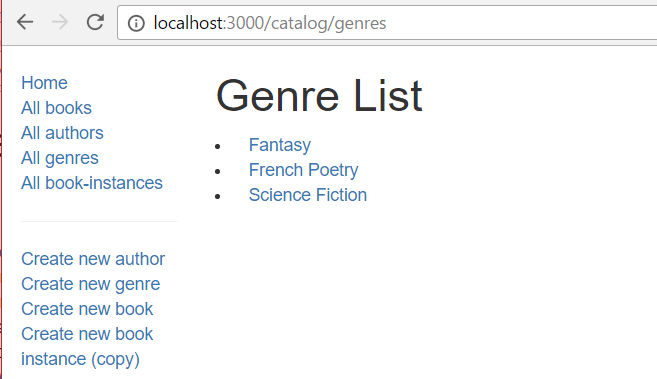

# Express Local Library

Ce code implémente [MDN Local Library tutorial](https://developer.mozilla.org/en-US/docs/Learn/Server-side/Express_Nodejs/Tutorial_local_library_website) en remplaçant Mongoose/MongoDB par Sequelize/MySQL.

## Utilisation

- Copiez le fichier `config/mysql.json.example` vers `config/mysql.json` et adaptez le à vos besoins.
- Assurez-vous que votre DB soit accessible à partir des infos que vous avez configuré dans `config/mysql.json`.
- Exécutez `npm install` une fois pour installer les dépendances.
- Exécutez `npm run populatedb` une fois pour remplir la DB avec des données.
- Exécutez `npm run serverstart` pour démarrer le serveur Node.js Express en mode développment.
- Pointez votre navigateur web vers http://127.0.0.1:3000/.

## Consignes

Votre objectif est d'implémenter l'URL qui affiche la liste des genres.
Cette page devrait afficher la liste de tous les genres connus de la base de données, avec un lien pour chaque genre vers sa page de détail associée.
Le screenshot du résultat attendu est montré ci-dessous.

## Étapes de résolution

*Ne lisez les instructions ci-dessous que si vous avez du mal à implémenter votre vue et votre contrôleur.*

Le contrôleur de la liste de genre a besoin de recupérer la liste de tous les `Genre`s et de la passer à un template pour générer le code HTML.

1. Vous devez éditer la méthod `genre_list()` dans le fichier `/controllers/genreController.js`.
2. L'implémentation est presque exactement la même que pour le contrôleur `author_list()`.
   Triez les résultat par nom, dans l'ordre alphabétique.
3. Le template pug doit s'appeler `genre_list.pug`.
4. Le template pug doit recevoir les données `title` ("Genre List") et `genre_list` (la liste des genres retournée par la DB).
5. La vue doit ressembler au screenshot ci-dessus (elle devait avoir une structure et un format très similaire à la vue de la liste des auteurs, excepté le fait que les fenres n'ont pas de date).
